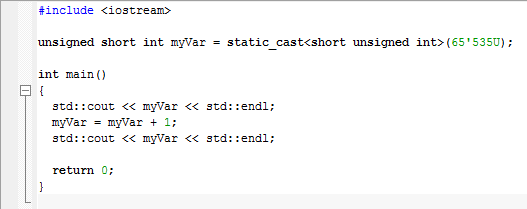

[#__iar_embedded_workbench]
== Работа в IAR Embedded Workbench
Сперва был создан проект C++ в программе *IAR Embedded Workbench* (рисунок 1).

.Создание проекта в программе
image::IAR/file.png[]

=== Изучение переменной типа unsigned short

После того как проект был создан объявим глобальную переменную
типа _unsigned short_ и присвоим ей значение 65535. Затем необходимо
прибавить к данной переменной единицу.Полученный результат кода представлен на рисунке 2.

.Полученный код

Запустим программу и откроем терминал (_View -> Terminal I/O_) (рисунок 3).

.Открытие терминала

Открыв терминал запустим пошаговую отладку (рисунок 4).

.Результат выполнения программы

В ходе выполнения пошаговой отладки было замечено, что при добавлении единицы к
числу 65535 получился на выходе 0.

Это случилось потому что произошла потеря бит из-за того, что переменной не было
выделено достаточно памяти для их хранения и произошло переполнение переменной.

В нашем случае переменная типа _unsigned short_ может занимать *2 байта*, а число 65536
уже занимает *3 байта*, то есть 1111 1111b + 1b = 1 0000 0000b (два младшие байты равны 0) (рисунок 5).

.Диапазоны данных

=== Изучение переменной типа signed short

Далее необходимо изменить тип переменной на _signed short_ и присвоить
ей значение 32767. Полученный код представлен на рисунке 6.

.Полученный код

Запустим программу и аналогично предыдущему пункту проделаем пошаговую отладку.
Результат представлен на рисунке 7.

.Результат отладки

В ходе выполнения пошаговой отладки было замечено, что при добавлении единицы к
числу 32767 получили на выходе -32768.

Это случилось потому что произошло переполнение переменной, в которой
старший бит зарезервирован под знак числа. После того как он заполнился, число
превратилось в максимально возможное отрицательное (рисунок 8).

.Диапазоны данных

=== Вывод адреса переменной в терминал

Далее необходимо не меняя тип переменной взять адрес переменной (_оператор &_)
- вывести адрес переменной в терминал.

Для этого ничего не меняя добавим новую строчку в программу:

*std::cout << &myVar << std::endl;* _// вывод адреса переменной в терминал_

Запустим отладку и посмотрим на результат (рисунок 9). Для этого
также откроем окно _Watch_ чтобы сравнить адреса.

.Вывод адреса переменной в терминал и окно Watch

Адреса переменной в терминале и окне Watch совпадают: *0x20000008*.

=== Неявное преобразование адреса переменной

Далее нужно не меняя переменной - явно преобразовать адрес переменной
к типу *указатель* на _short_ используя _reinterpret_cast_ и присвоить
локальной переменной типа _short*_.

_reinterpret_cast_ преобразует типы, несовместимыми друг с другом.

На рисунке 10 представлен измененный код с явным преобразованием, а
также окно терминала.

.Код программы и результат выполнения

Как видно из отладки --  адрес переменной и *указатель*, который
хранит адрес этой переменной, равны между собой, т.к.
_signed short_ и _short_ являются одним и тем же.

Добавим строку:

*std::cout << *ptr << std::endl;*

с помощью которой выведем значение переменной с этого адреса.

.Код программы и результат выполнения

Заметим, что по адресу лежит значние -32768, которое мы
записали до этого по данному адресу.

=== Разыменование указателя

Далее необходимо разыменовать указатель и вывести в
терминал значение лежащее по адресу, указанному в указателе.

Запишем по адресу, который хранится в указателе, значение 5.
Код программы представлен на рисунке 12.

.Код программы

Запишем переменную *ptr* в поле _Expression_, чтобы проверить
значение 5, хранящееся в указателе. Проверим это используя
окно _Watch_ и _Memory_. Затем в окне _Memory_ перейдем по
адресу 0x20000000 и посмотрим, что произошло.

.Начало программы

В данный момент по адресу 0x20000000 записано
число 32767 в шестнадцатеричной системе счисления
(_Hexademical_ формат). Теперь продолжим выполнение
программы и заметим следующее:

.Конец программы

Теперь по данному адресу находится значение 5.

Затем произведём явное преобразование этого указателя к типу
указателя на _int_, разыменуем и выведем значение, лежащее
по адресу указателя.

.Полученный результат

В окне терминала было получено значение 5, находящееся по адресу
указателя.

Прибавим единицу к переменной _*ptr_:

.Пошаговый запуск программы

.Ход работы программы

.Завершение отладки

В ходе выполнения отладки перменная _*ptr_ изменилась с 32767
на 0, т.к. указатель стал указывать на другую область
памяти, в которой хранится ноль.

Переменная ptr изменилась с 0x20000008 на 0x2000000A.
Это произшло потому что _short_ - 2-байтовый тип переменной и
мы прибавили к восьмерке 2 и получилось 10 (то есть A,
в 16-разрядном формате).

=== Повторное исследование переменной типа short

Сначала необходимо заменить тип переменной с _unsigned short_
на _short_ и присвоить ей значение 65535.

Код программы представлен на рисунке 19.

.Код программы

Запустим отладку (рисунок 20).

.Результат программы

При изменении типа переменной на _short_ со значением
65535 в терминале получаем -1.

Это получилось потому что наибольшее число, которое можно
без переполнения положить - это 32767.
А число 65535 = (32767 + 1) + 32767= -32768 + 32767 = -1.

Далее необходимо сделать явное преобразование типа к _short_ и
объяснить полученный результат.

Добавим следующую строку:

*std::cout << static_cast<short>(myVar) << std::endl;*

Произведем отладку:

.Полученный результат

После явного преобразования было получено такое же значение -1.
Это произошло из-за того, что мы
производили явное преобразование к такому же типу данных,
которым он и был до преобразования.

Теперь попробуем преобразовать переменную к типу
_unsigned short_, получим следующий результат:

.Полученный результат

Получилось значение 65535. Способ получения данного числа
является обратным к тому, что был описан в предыдущем
пункте: -1 = -32768 + 32767 = (32767 + 1) + 32767 = 65535.

Теперь преобразуем к типу _int_, получим:

.Полученный результат

Так как при преобразовании из _short int_ в
тип _int_ значение -1 будет прежним.

=== Изучение переменной типа float

Создадим переменную типа _float_ и присвоим
ей значение 40'000'000'000F. Затем прибавим
к этому значению 1.0f и выведем значение в окно Watch (рисунок 24).

.Полученный результат

Результаты в окнах Watch и Terminal
не отличаются, т.к. у типа _float_ не хватает точности,
чтобы отобразить прибавленную единицу.

Теперь заменим тип _float_ на _double_ и произведем аналогичные
действия (рисунок 25).

.Полученный результат

При смене типа данных переменной с _float_
на _double_ в окнах Watch и Terminal I/O значения стали разными,
т.к. у _double_ точность в два раза выше чем у _float_,
единица отобразилась.

